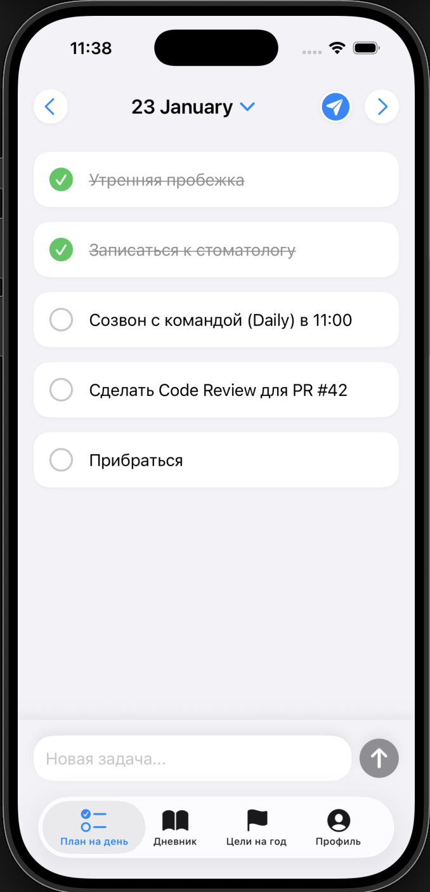
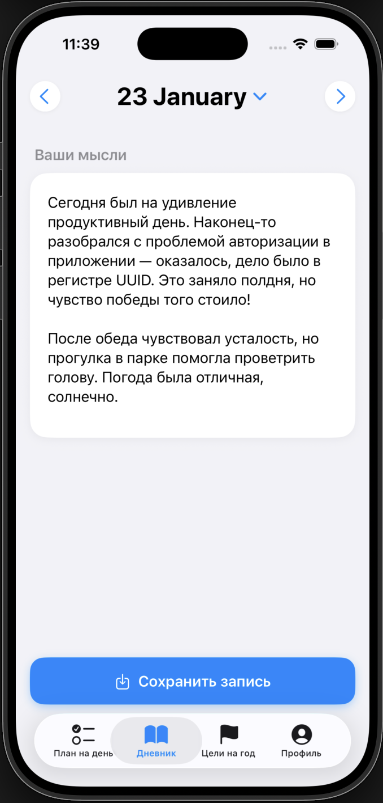
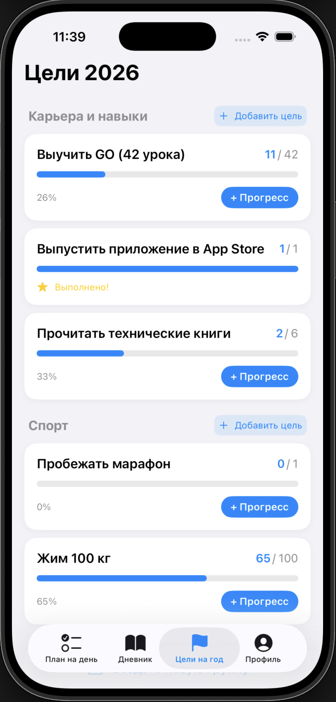
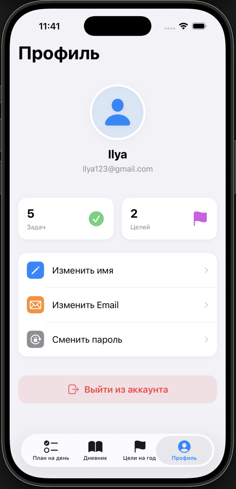
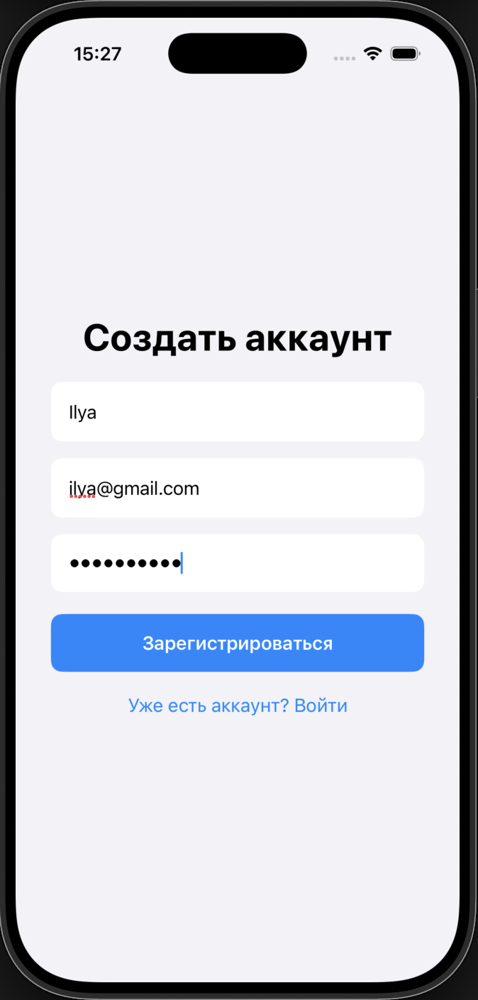
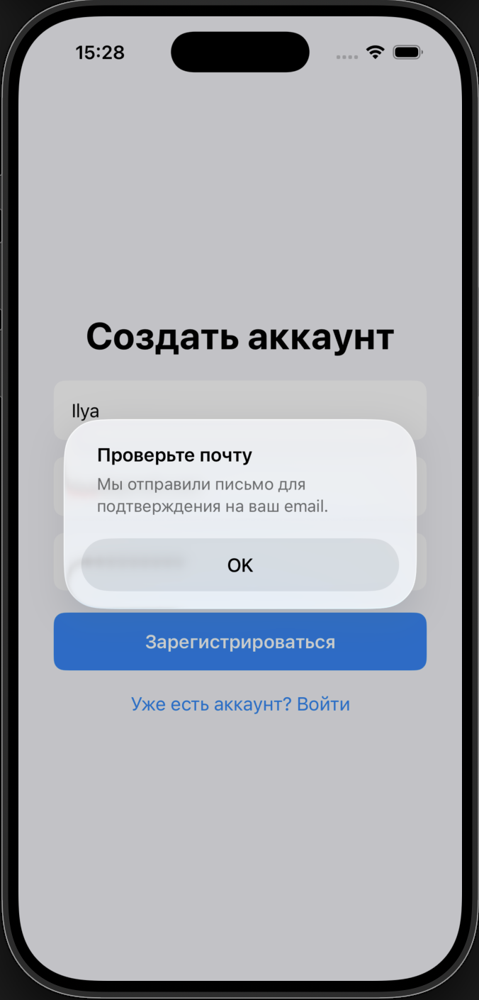
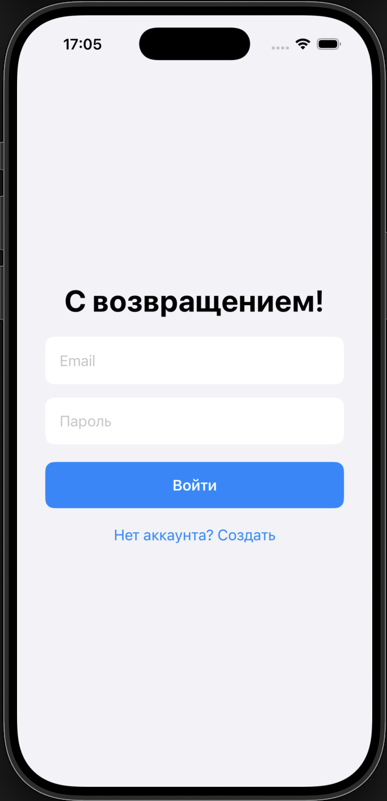
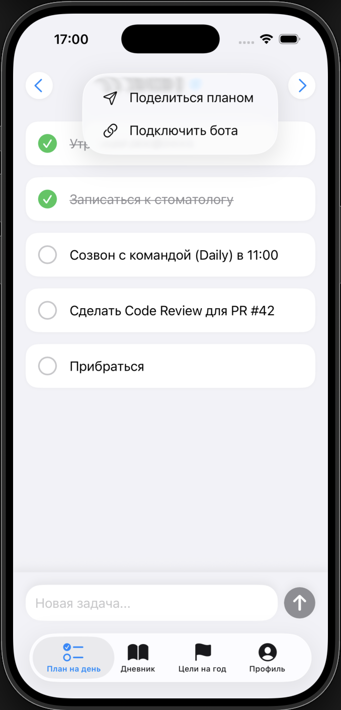
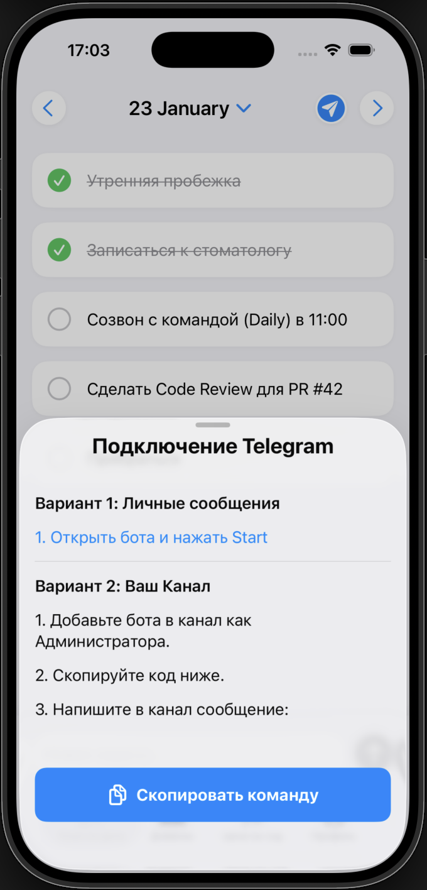
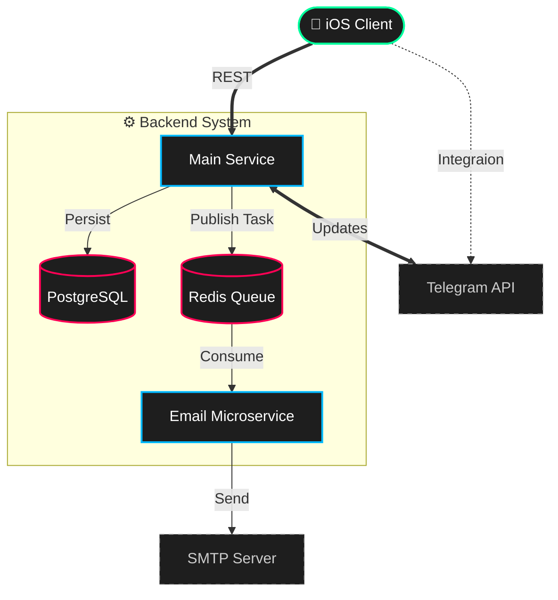

# 🚀 Productivity App

Полноценное мобильное приложение для планирования задач, ведения дневника и отслеживания годовых целей с  интеграцией Telegram. Реализована верификация почты при регистрации, где отправка писем вынесена в отдельный микросервис через очередь Redis, что обеспечивает высокую отзывчивость основного API.

##
### Основные экраны:

  
   
  
  

##
### Регистрация и вход:

  
   
  

##
### Интеграция с telegram:

  
  
   

## 🌟 Особенности

*   **План на день:** Управление задачами, календарь, отметки выполнения.
*   **Дневник:** Записи привязаны к датам, сохранение мыслей.
*   **Цели на год:** Древовидная структура (Группы -> Цели), трекинг прогресса.
*   **Профиль пользователя:** Редактирование личных данных, смена пароля и управление сессией.
*   **Telegram Интеграция:** Бот для шеринга планов и отчетов в личные сообщения или каналы.
*   **Безопасность:** 
    *   Система авторизации (JWT Access + Refresh tokens).
    *   **Email Verification:** Подтверждение регистрации через реальную почту.

---

## 🛠 Технический стек

### 📱 iOS Client (Swift)
*   **UI:** SwiftUI, MVVM Architecture.
*   **Concurrency:** Swift Concurrency (async/await), Task Groups.
*   **Network:** URLSession, Codable (Custom decoding strategies), Generic API Service.
*   **Security:** Keychain (хранение токенов).
*   **Integration:** Deep Links (для связи с Telegram ботом).

### ⚙️ Backend (Go)
*   **Architecture:** Clean Architecture + **Microservices**.
*   **Web Framework:** Gin.
*   **Database:** PostgreSQL + pgx (driver) + Squirrel (Query Builder).
*   **Async Processing:** Redis + Asynq (для фоновых задач).
*   **Migrations:** Goose.
*   **Auth:** JWT (Access/Refresh rotation), Bcrypt.
*   **Concurrency:** Graceful Shutdown, Goroutines для бота.
*   **Infrastructure:** Docker, Docker Compose.

---

## 🏗 Архитектура

### 🧩 Компоненты системы
1.  **Main API (Monolith):** Обрабатывает HTTP-запросы от мобильного приложения, управляет данными и бизнес-логикой.
2.  **Email Worker (Microservice):** Отдельный сервис, который занимается исключительно отправкой писем.
3.  **Telegram Service:** Интегрированный в основное приложение модуль, работающий через Long Polling.

### 📨 Асинхронная обработка
Для отправки писем (например, при подтверждении регистрации) используется паттерн **Producer-Consumer**:
1.  Основной API (Producer) не отправляет письмо сам, чтобы не блокировать запрос пользователя.
2.  Вместо этого он ставит задачу в очередь **Redis** (используя библиотеку `Asynq`).
3.  Отдельный **Email Worker** (Consumer) забирает задачу из Redis и выполняет отправку через SMTP.
Это гарантирует, что пользователь получает мгновенный ответ от сервера, даже если почтовый сервис работает медленно.

### 🗄 Database Schema
*   `Users` — Хранение учетных записей (включая флаг `is_verified`).
*   `VerificationTokens` — Временные токены для подтверждения почты.
*   `DailyTasks` / `DiaryEntries` — Данные, привязанные к дате.
*   `YearlyGoals` / `GoalGroups` — Иерархические цели.
*   `TelegramIntegrations` — Связь аккаунта приложения с Telegram ID.

### Схема взаимодействия

